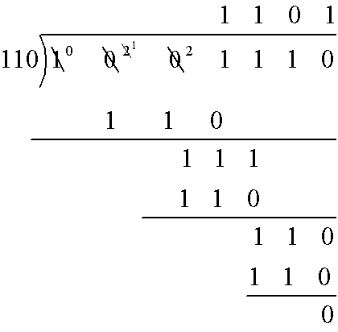
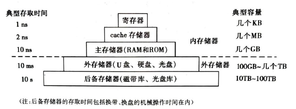
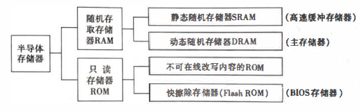
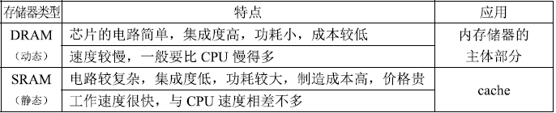
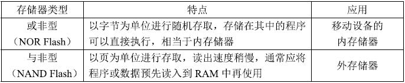
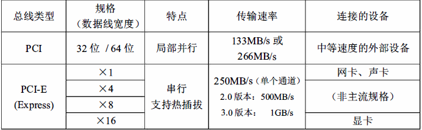
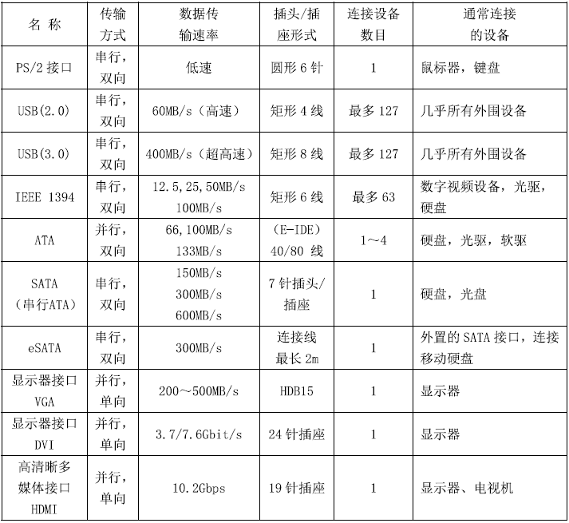
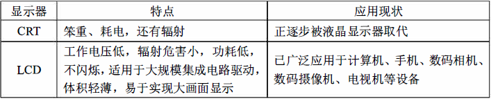
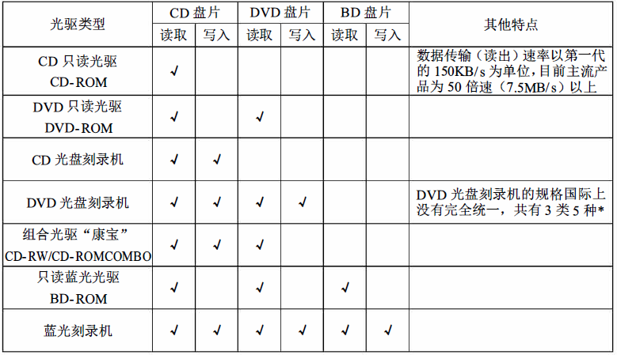

# 计算机基础

## 信息技术概述

### 信息与信息技术

#### *信息

客观世界三构素：信息、物质、能量

1.客观事物立场：事物运动的状态及状态变化的方式

2.认识主体立场：认识主体所感知或所表述的事物运动及其变化方式的形式、内容和效用

3.信息是人们认识世界和改造世界的一种基本资源

*4.信息是客观世界中各种事物**运动状态**和**变化内容的反应**，是认识主体对客观事物状态和变化的感知

*5.信息可以分为**数值型数据**和**非数值型数据**

*6.**数据**是信息的表现形式和载体

#### *信息处理过程（行为和活动）

- 收集
- 加工
- 存储
- 传递
- 施用

#### *信息技术IT

*用来**扩展**人的信息器官功能、**协助**人们进行信息处理的一类技术

*1.扩展人类感觉器官功能的**感测（获取）技术与识别技术**

*2.扩展神经系统功能的**通信技术**

*3.扩展大脑功能的**计算（处理）与存储技术**

*4.扩展效应器官手，脚等功能的**控制与显示技术**

#### *现代电子信息技术

*1.特点：以**数字技术（计算机）**为基础、**软件与通信技术**为核心、采用**电子技术**进行信息的收集、传递、加工、存储、显示与控制

2.设计领域：通信、广播、计算机、微电子、遥感遥测、自动控制、机器人等

3.核心技术：微电子技术、通信技术、计算机技术

**软件技术是信息技术的核心**


## 数字技术基础

### 比特与字节

#### 比特（b）

数字技术的处理对象是 “比特”，其英文为"bit", 中文译为 “二进制数字” 或 “二进位”。 比特只有两种状态（取值）：它或者是数字0, 或者是数字1。
比特是计算机和其他所有数字设备处理、存储和传输信息的最小单位，一般用小写字母"b" 表示。


#### 字节（B）

1000 0000 = 8b = 1B

另一种稍大些的数字信息的计量单位是“字节"(byte), 它用大写字母"B"表示， 每个字
节包含8个比特。
**字节是计算机处理、存储和传输信息的基本单位。**


### 定点数

**约定计算机中小数点的位置**

例：

约定小数点在末两个数字前

222222.22

333331121.44

约定小数点在所有数字后（及表示整数）

22222.

3333333.


### 进制运算

D ---十进制
H ---十六进制
B ---二进制
O或者Q ---八进制

十进制对应的二进制数

| 十进制 | 二进制 |
| ---- | ---- |
| 1| 1  |
| 2| 10  |
| 4| 100  |
| 8| 1000  |
| 16| 10000  |
| 32| 100000  |
| 64| 1000000  |
| 128| 10000000  |
| 256| 100000000  |
| 512| 1000000000  |


#### 二进制乘法


```
3*512+7*64＋4*8＋5，转换为2进制
首先，将其转换为2进制
11*1000000000+111*1000000+100*1000+101
二进制的乘法：
例如：
11*101
       11
  x  101
---------
      101
+  101
---------  
    1111
同理得出
110 0000 0000+1 1100 0000+10 0000+101+111 1110 0101

```


#### 二进制除法




#### 十进制整数转二进制

```
十进制：254

254/2=127余0
127/2=63余1
63/2=31余1
31/2=15余1
15/2=7余1
7/2=3余1
3/2=1余1
1/2=0余1

二进制:1111 1110
```


#### 十进制小数转二进制

```
十进制：0.625
0.625*2=1.25				取出整数部分1
0.25*2=0.5					  取出整数部分0
0.5*2=1							取出整数部分1

二进制：0.101
———————————————————
十进制：0.7

0.7*2=1.4                     取出整数部分1
0.4*2=0.8                     取出整数部分0
0.8*2=1.6					  取出整数部分1
0.6*2=1.2  					  取出整数部分1
0.2*2=0.4 		          	 取出整数部分0
0.4*2=0.8				      取出整数部分0
0.8*2=1.6					 取出整数部分1
.........
二进制:0.1011001.....
```


#### 二进制转八进制

二进制：1001110011

首先先三位为一组，不满三位头部填0

**0**10 011 100 110

2     3     4      6

八进制：2346


#### 二进制转十六进制

二进制：111110101101

首先先四位为一组，不满四位头部填0

1111 1010 1101<br/>
15     10	 13

16进制从10开始对应字母

| 十进制 | 十六进制 |
| ------ | -------- |
| 10     | A        |
| 11     | B        |
| 12     | C        |
| 13     | D        |
| 14     | E        |
| 15     | F        |

因此

15-F<br/>
10-A<br/>
13-D<br/>
十六进制：FAD


#### 二进制逻辑运算

##### 与运算^（逻辑加）

全0为0

​    0 1 1 0<br/>
^ 1 1 1  1<br/>
\-\-\-\-\-\-\-\-\-\-\--<br/>
​    0 1 1 0<br/>


##### 或运算V（逻辑乘）

全1为1

​    0 1 1 0<br/>
V 0 1 1  1<br/>
\-\-\-\-\-\-\-\-\-\-\--<br/>
​    0 1 1 1<br/>


##### 取反运算-

-01011=10100


##### 异或

相同为0

不同为1


##### 与或

相同为1

不同为0


### 原码、反码与补码

#### 原码

**原码就是符号位加上真值的绝对值，**即用第一位表示符号，其余位表示值。比如：如果是8位二进制：

[+1]原= 0000 0001

[-1]原= 1000 0001

第一位是符号位，因为第一位是符号位，所以8位二进制数的取值范围就是：（即第一位不表示值，只表示正负。）

[1111 1111 , 0111 1111]

即

[-127 , 127]

**原码是人脑最容易理解和计算的表示方式。**


#### 反码

反码的表示方法是：

正数的反码是其本身；

负数的反码是在其原码的基础上，符号位不变，其余各个位取反。

[+1] = [0000 0001]原= [0000 0001]反

[-1] = [1000 0001]原= [1111 1110]反

可见如果一个反码表示的是负数，人脑**无法直观的看出来**它的数值。通常要将其转换成原码再计算。


#### 补码

补码的表示方法是：

正数的补码就是其本身；

负数的补码是在其原码的基础上，符号位不变，其余各位取反，最后+1。(也即在反码的基础上+1)

[+1] = [0000 0001]原= [0000 0001]反= [0000 0001]补

[-1] = [1000 0001]原= [1111 1110]反= [1111 1111]补


#### 浮点字符的规范化表示

规范化表示二进制数

-11.001

公式：**N=SX2<sup>p</sup>**

**S**表示**尾数**

**P**表示**阶码**

-0.11001X2<sup>2</sup>

| 阶码符号 | 阶码 | 尾数符号 | 尾数位 |
| -------- | ---- | -------- | ------ |
| 0        | 10   | 1        | 11001  |

注意：尾数的小数开头必为1

例如

二进制数：0.0000001101

的尾数为**0.1101**X2<sup>-6</sup>

因此阶码越大，可表示的数越大

尾数越大，被表示的数精度越高


### ASCII 码

| 常用字符 | ASCII码 |
| -------- | ------- |
| 空格     | 32      |
| 0        | 48      |
| A        | 65      |
| a        | 97      |

要点：

大写A的ASCII码小于小写a，它们相差不是26而是32


1110 0001
奇校验规定：正确的代码一个字节中1的个数必须是奇数，若非奇数，则在最高位b7添1；

0110 0001

偶校验规定：正确的代码一个字节中1的个数必须是偶数，若非偶数，则在最高位b7添1。

8位中最高为就用来做数据校验，其余7位用于数据表示

ASCII码字符集有128个字符，其中96个是可见字符，32个可控制字符


## 微电子技术

微电子技术以**集成电路技术**为核心，**集成电路芯片**是信息产业的基础


### 集成电路

定义：以**半导体单晶片**作为材料，采用平面工艺加工，将大量晶体管、电阻等元器件及互连线构成的电子线路集成在基片上，构成一个微型化的电路或系统。

特点：**体积小，重量轻，可靠性高，功耗小。**

现代电路集成电路使用的半导体材料：硅、砷化镓。

工艺技术名称：硅平面工艺。

技术指标：线宽（主流技术线宽为45纳米或65纳米）

集成电路的工作速度主要取决于**组成逻辑门电路的晶体管尺寸**，晶体管尺寸越**小**，其极限工作频率就越**高**，门电路的开关速度就越**快**。


#### 集成电路的制作过程


### 集成电路分类

按所包含的电子原件数目分：

1. 中小规模集成电路的集成对象：**简单的门电路或单极放大器**；
2. 大规模集成对象：**功能部件、子系统**；

PC机所使用的微处理器、芯片组、图形加速芯片都是**超大规模**（VLSI）

按功能分：**数字集成电路、模拟集成电路、数/模混合集成电路。**

按用途分：**通用集成电路、专用集成电路**


### 摩尔定律

单块集成电路的集成度平均每**18~24**个月翻一番


### IC卡/集成电路卡

#### 按功能和用途分

**存储卡**（包括带加密逻辑的存储器卡）

**CPU卡**（如手机ISM卡）


#### 按使用方法分

**接触式**（通过金属触点传输数据）

**非接触式卡**（卡中无电池：利用电磁感应无线传输数据）

我国的第二代身份证、多数公交IC卡位**非接触式IC卡**


### RFID

RFID的中文名称是“电子标签“，它的原理与非接触式 IC卡相似，标签中包括耦合元件（线圈）及芯片， 它附着在物体表面用以标识目标对象， 每个RFID标签具有唯一的电子编码，使用阅读器可以读取（有时还可写入）标签中信息。


## 计算机的发展与作用

**世界上的第一台通用计算机是1946年诞生于美国的ENIAC（Electronic Numerical Integrator And Computer 电子数字积分计算机）**


### 计算机的特点

1. 速度极快
2. 通用性强
3. 存储容量大
4. 具有互联、互通和互操作的特性
5. 体积小，功耗低，方便携带，甚至可以穿戴


### 计算机的重要性

1. 计算机应用于科学研究，大大增强了人类认识自然及开发、 改造和利用自然的能力，促进了现代科学技术的发展。
2. 计算机应用于工农业生产，显著提高了人类物质生产水平和社会劳动生产率，促进了经济的飞跃发展。
3. 计算机应用于社会服务，全面扩展和改善了服务范围与质量，提高了工作效率，推进了社会进步。
4. 计算机应用于教育文化，为人类传承并创造知识与文化提供了现代化工具，改变了人们创造和传播文化的方式和方法，大大扩展了人类文化活动的领域，丰富了文化的内容，提高了文化质晕。
5. 计算机进入办公室和家庭， 已经并还将改变人们的工作和生活方式。计算机科学技术对千一个国家发展政治、 经济、 教育、 文化、 国防等方面的催化作用和强化作用，且有难以估晕的意义。

| 代别  | 年代                                            | 使用的主要元器件                                             | 使用的软件类型                                   | 主要应用领域                                     | 应用模式                                         |
| ----- | ----------------------------------------------- | ------------------------------------------------------------ | ------------------------------------------------ | ------------------------------------------------ | ------------------------------------------------ |
| 第1代 | (1946~1957)<br />20世纪40年代中期~50年代末期    | CPU：电了管内存：磁鼓                                        | 使用机器语言和汇编语言编写程序                   | 科学和1：程计算                                  | 集中计算模式                                     |
| 第2代 | (1957~1964)<br />20世纪50年代中后期~ 60年代末期 | CPU：晶体管内存：横鼓                                        | 使用FORTRAN等高级程序设计语言                    | 开始广泛应用于数据处理领域                       | 集中计算模式                                     |
| 第3代 | (1965~1973)<br />20世纪60年代中期〜70年代初期   | CPU：中、小规模柒成电路内存:中、小规模集成电路的     半导体存储器 | 操作系统、数据库管理系统等普遍便用               | 在科学计算、数据处理、工业控制等领域得到广泛应用 | 集中计算模式                                     |
| 第4代 | (1974至今)<br />20世纪70年代中期以来            | CPU：大、超大规模集成电路内存：大、超大规模集成电路的半导体存储器 | 软件开发工具和平台、分布式计算软件等开始广泛使用 | 深入到各行各业，家庭和个人普遍使用计算机         | 分散计算模式（80年代起）网络计算模式（90年代起） |


### 计算机的组成

计算机系统由硬件和软件构成。

从逻辑上（功能上）来讲，主要包括中央处理器(CPU)、内存储器、 外存储器、输入设各和输出设备，它们通过总线相互连接。CPU、主存储器、总线等构成了计算机的 “主机”，输入输出设备和外存储器通常称为计算机的 “外围设备“，简称 “外设“。


### CPU


CPU的根本任务是执行指令， 它按照指令的要求完成对数据的基本运算和处理。 原理上它主要由三个部分组成：

**寄存器组：**临时存放参加运算的数据和运算得到的中间（或最后） 结果

**运算器：**来对二进制数据进行运算器进行加、 减、 乘、 除或者与、 或、 非等各种基本

算术运算和逻辑运算，所以也成为算术逻辑部件(ALU)。运算器中的ALU可能有多个，有的负责完成整数运算，有的负责完成实数（浮点数） 运算，有的还能进行一些特殊的运算处理。

**控制器：**这是CPU指挥中心。 它有一个指令计数器，用来存放CPU正在执行的指令的地址，CPU按照该地址从内存读取所要执行的指令。 控制器中还有一个指令寄存器， 它用来保存当前执行的指令，通过译码器解释该指令的含义，控 制运算器的操作，记录CPU的内部状态等。

一台计算机往往有许多处理器，其中**承担系统软件和应用软件运行任务**的处理器才称为"CPU"

使用**多个CPU**实现超高速计算机的技术称为**并行处理**


### CPU的性能指标

**字长（位数）**：字长指的是CPU中通用寄存器／定点运算器的宽度（即二进制整数运算的位数）。由于存储器地址是整数，整数运算是定点运算器完成的，因而定点运算器的宽度也就大体决定了地址码位数的多少。而地址码的长度决定了CPU 可访问的最大内存空间。

**主频(CPU时钟频率）**：主频指的是CPU 中电子线路的工作频率。CPU主频决定着CPU内部数据传输与操作速度的快慢。一般而言， 执行一条指令需要1 个或几个时钟周期，所以主频越高， 执行一条指令需要的时间就越少， CPU的处理速度就越快。

**CPU总线速度**： CPU总线速度指的是CPU运行时CPU总线（前端总线） 的速度。CPU总线速度越快， CPU的性能将发挥得越充分。

**高速缓存(cache)的容量与结构**：程序运行过程中高速缓存有利千减少CPU访问内存的次数。通常， cache的容量越大、级数越大， 其效用就越大。

指令系统： 指令的类型和数目、指令的功能都会影响程序的执行速度。

**逻辑结构**： CPU的逻辑结构主要是指对整个CPU从思想的分类， 把CPU 分成若千个逻辑单元， 每个逻辑单元分别实现自己的功能。CPU包含的定点运算器和浮点运算器数目、是否具有数字信号处理功能、有无指令预测功能、流水线结构和级数等都对指令执行的速度有影响， 甚至对某些特定应用得很大的影响。

**内核个数**：为提高CPU芯片的性能， 现在CPU芯片往往包含有2 个、4个、6个甚至更多CPU 内核，每个内核都是一个独立的CPU, 有各自的1级和2级cache,共享3级cache和前端总线。在操作系统支持下， 多个CPU内核并行工作， 内核越多， CPU芯片的整体性能越高。


### 指令与指令系统

**指令：**在计算机内部，程序是由一连串指令构成的，指令是构成程序的基本单位。指令采用二进制表示，它用来规定计算机执行什么操作。在大多数情况下，指令由操作码和操作数地址两部分构成。

**指令系统：**每一种CPU都有它自己独特的一组指令。CPU所能执行的全部指令称为该CPU的指令系统。

**Core i3/i5/i7处理器中的指令：**Core i3/i5/i7处理器共用七大类指令，即苏剧传输类、算数运算符类、逻辑运算类、移位操作类、位（位串）操作类、控制转移类、输入/输出类。每一类指令（如数据传送类、算数运算类）又按照操作数的性质（如整数还是实数）、操作数长度（16位、32位、64位、128位等）等区分为若干不同的指令。


### 存储器

内存储器：又称为主存储器、工作存储器。直接与CPU高速连接，按字节编址。断电会丢失数据

外存储器：又称为辅助存储器。使用要先通过内存储器址才能被CPU进行处理（不能也不需要按字节编址）


### 输入设备

将信息送入计算机


### 输出设备

把计算机中的二进位信息转换成人可感知的形式


### I/O与总线

**总线：**适用于在计算机各功能之间传输信息并协调他们工作的一组公共**传输线**及其**控制电路**。


**I/O:**

作用：海纳百川各种I/O设备

**类型：**并、串、视频、USB等


### 主板

主板又称母版， 在主板上通常安装有CPU插座、芯片组、存储器插槽、扩充卡插槽、显卡
插槽、BIOS、CMOS存储器、辅助芯片和若干用千连接外围设备的1/0接口。
CPU芯片和内存条分别通过主板上的CPU 插座和存储器安装在主板上。PC机常用外围设
备通过扩充卡（例如声音卡、显示卡等） 或1/0接口与主板相连，扩充卡借助卡上的印刷插
头插在主板上的PCI 总线插槽中。随着集成电路的发展和计算机设计技术的进步， 许多扩
充卡的功能可以部分或全部集成在主板上（例如，串行口、并行口、声卡、网卡等控制电路）。


**BIOS**

BIOS的中文名叫做基本输入／输出系统，它是存储在主板上闪速存储器中的一组机器语言程
序。山千存放在闪存中， 因此即使机器关机， 它的内容也不会改变。
BIOS 包含以下四部分程序：

1. 加电自检程序（即POST程序）；
2. 系统盘主引导记录的装入程序（简称“引导装入程序”， 其第一步为自举程序）；
3. CMOS设置程序；
4. 基本外围设备的驱动程序。


### CMOS

CMOS存储器中存放着与计算机系统相关的一些参数（称为“ 配置信息"), 包括当前的日
期和时间、开机口令、已安装的光驱和硬盘的个数及类型等。
CMOS芯片是一种易失性存储器， 它由主板上的电池供电， 即使计算机关机后它也不会丢
失所存储的信息。


### 北桥和南桥芯片（芯片组）

芯片组是PC机各组成部分相互连接和通信的枢纽，存储器控制I/O控制功能几乎都集成在芯片组内，它既实现了PC机总线控制的功能，又提供了各种I/O接口及相关控制。没有芯片组，CPU就无法与内存、扩展卡、外设等交换信息。

芯片组一般由2块超大规模集成电路组成：北桥芯片和南桥芯片。北桥芯片是存储中心（MCH），用于高速连接CPU、内存、显卡、并与南桥芯片互连；南桥芯片是I/O控制中心（ICH），主要与PCI总线插槽、USB接口、硬盘接口、音频编解码器、BIOS和CMOS存储器连接，并借助Super I/O 芯片提供对键盘、鼠标、串行口和并行口等的控制。CPU的时钟信号也由芯片组提供。

北桥决定决定计算机支持什么样的CPU，什么样的内存，什么样的内存，什么样的显卡。南桥芯片决定主板能接什么样的硬盘、光驱以及由多少个USB口等等。

有些CPU芯片将北桥芯片的存储控制器和图形处理器功能集成在CPU中，使用这些芯片的计算机主板上北桥芯片已经消失，只需一块南桥芯片即可。


### 内存储器



计算机中的存储器分为内存和外存两大类。 内存的存储速度快而容鼠相对较小， 它与CPU 高速相连用来存放已经启动运行的程序和正在处理的数据。 外存的存取速度较慢而容最相 对很大， 它与CPU 并不直接连接， 用千持久地存放计算机中几乎所有的信息。



内存储器由称为存储器芯片的半导体集成电路组成。半导体存储器芯片主要按照是否能随机
地进行读写， 分为随机存取存储器( RAM)和只读存储器(ROM)两大类。


1. RAM ( 随机存取存储器）

   RAM目前多采用MOS型半导体集成电路芯片制成，根据其保存数据的机理又可分为动

   态随机存取存储器(DRAM)和静态随机存取存储器(SRAM)两大类。

   主存储器主要是山DRAM 芯片组成的。它包含大量的存储单元，每个存储单元可以存放

   1个字节。主存储器在物理结构上由若干内存条组成。

   

2. ROM(只读存储器)

   目前使用最多的是闪速存储器（Flash ROM，快擦除ROM）。

   

- 存取时间

存储器的存取时间指的是从CPU给出存储器地址开始到存储器读出数据并送到CPU(或者是把CPU数据写入存储器） 所需要的时间。 主存储器存取时间的 单位是ns(纳秒）。


### I/O总线

总线的英文名字是"bus", 它指的是计算机部件之间传输信息的一组公用的信号线及相关控
制电路。CPU芯片与北桥芯片相互连接的总线称为CPU总线（前端总线， FSB), I/0设备
控制器与CPU、存储器之间相互交换信息、传输数据的一组公用信号线称为I/0总线，也叫
作主板总线， 因为它与主板上扩充插槽中的各扩充板卡(I/0控制器）直接连接。
总线上有三类信号：数据信号、地址信号和控制信号， 传输这些信号的线路分别是数据线、
地址线和控制线， 协调与管理总线操作的是总线控制器（在CPU 或芯片组内）。




### I/O接口

计算机中用千连接I/0设备的各种插头／插座以及相应的通信规程及电气特性，就称为I/O设
备接口， 简称I/O接口。
USB中文名称是“通用串行总线”， 是一种可以连接多个设备的总线式串行接口。USB接口
的最大特点是支持“即插即用” 和“ 热插拔"。
一个USB接口连接多个设备时， 它们以主从方式进行工作， 即所有数据传输操作都由主设
备主动发起， 从设备负责应答。通常主机是主设备， 外设是从设备。带USB接口的外设可
以自己供电， 也可通过USB接口由主机供电。
PC机常用的1/0接口、性能和可以连接的外围设备：




### 键盘、鼠标、扫描仪、数码相机

#### 键盘

键盘上的按键大多是电容式的。 电容式键盘的优点是：击键声音小，无触点，不存在磨损和 接触不良等问题，寿命较长，手感好。 为了避免电极间进入灰尘，按键采用密封组装，键体 不可拆卸。
键盘与主机连接采用PS/2或USB接口。

#### 鼠标

当用户移动鼠标器时， 借助千机电或光学原理，鼠标移动的距离和方向（或X方向及Y方
向的距离）将分别变换成脉冲信号输入计算机，计算机中运行的鼠标驱动程序把接收到的脉
冲信号再转换成为鼠标器在水平方向和垂直方向的位移晕， 从而控制屏幕上鼠标箭头的运
动。
现在流行的鼠标器结构是光电鼠标， 它的工作速度快， 准确性和灵敏度高（分辨率可达
800dpi), 几乎没有机械磨损， 很少需要维护， 也不需要专用鼠标垫。除了玻璃、金属等光
滑表面外， 几乎在任何平面上均可操作。
鼠标器与主机的接口主要有PS/2和USB两种。

#### 扫描仪

扫描仪是将原稿（图片、照片、底片、书稿） 的影像输入计算机的 种输入设备。按扫描仪 的结构来分， 扫描仪可分为手持式、平板式、胶片专用和滚筒式等几种。

1. 手持式扫描仪工作时， 操作人员用手拿考扫描仪在原稿上移动。 它的扫描头比较窄，只适用千扫描较小的原稿。

2. 平板式扫描仪主要扣描反射式原稿， 它的适用范围较广， 单页纸可扫描， 一本书也可逐页扫描。 它的扫描速度、 精度、 质量比较好， 已经在家用和办公自动化领域得到了广泛应用。

3. 胶片扫描仪和滚筒式扫描仪都是高分辨率的专业扫描仪， 它们在光源、色彩捕捉等方面均具有较高的技术性能，光学分辨率很高，这种扫描仪多数都应用千专业印刷排版领域。 

   

扫描仪是基千光电转换原理而设计的，上述几种类型的扫描仪工作原理大体相同，只不过是结构 和使用的感光器件不同而已。


**平板式扫描仪的工作原理**

扫描仪工作时，将被扫描的原稿正面朝下，放置在扫描仪玻璃板上。扫描仪采用高密度的光
束照射图像，由电机牵动的扫描头沿着原稿移动，并接收从原稿反射回来的光束。由千黑色、
白色、彩色的不同以及灰度的区别，反射回来的光的强度也有不同，这种反射光被聚焦后照
射在分别装有红、蓝、绿滤镜的三排CCD(电荷耦合器件） 感光器件上， 通过光电转换产
生电流输出。照射光强， 电流大， 照射光弱， 电流小， 再经过数模转换器转换， 就变成计算
机可以处理的数字信号。这种数字信号还要由专门的软件进行各种校正和平滑处理，得到的
图像数据以指定的文件格式（如TIF文件） 存储在计算机中。


**扫描仪的主要性能指标**

1. 扫描仪的光学分辨率：反映了扫描仪扫描图像的清晰程度， 用纵向和横向每英寸的取样点（像素）来表示；
2. 色彩位数（像素深度）：反映扫描仪对图像色彩的辨析能力，色彩位数越多，反映的色彩就越丰富， 得到的数字图像效果也越真实；
3. 扫描幅面： 允许被扫描原稿的最大尺寸；
4. 与主机的接口： 如USB接口或IEEE-1394接口等。


### 数码相机

数码相机是另一种重要的图像输人设备。与传统照相机相比，数码相机不需要使用胶卷，能

直接将照片以数字形式记录下来， 并输入电脑进行存储、处理和显示，或通过打印机打印出

来， 或与电视机连接进行观看。

-  数码相机的工作原理

数码相机的镜头和快门与传统相机基本相同，不同之处是它不使用光敏卤化银胶片成像，而

是将影像聚焦在成像芯片(CCD或CMOS)上， 并由成像芯片转换成电信号，再经模数转换

变成数字图像， 经过必要的图像处理和数据压缩（大多采用JPEG标准） 之后， 存储在相机

内部的存储器中。其中成像芯片是数码相机的核心。

- 数码相机的主要性能指标
  1. CCD像素个数： 决定照片图像能达到的最高分辨率。
  2. 存储器的容址：保存CCD成像并转换后得到的数字图像的数据。


### 显示器、打印机

1. 显示器

   计算机显示器通常由两部分组成：显示器和显示控制器。显示器是一个独立的设备。显示控制器在PC机中多半做成扩充卡的形式， 所以也叫作显示卡（显卡）、图形卡或者视频卡。
   计算机使用的显示器主要有两类： CRT显示器和液晶显示器(LCD)。




- 液晶显示器的主要性能参数

  1. CD显示屏的尺寸。与电视机相同，计算机显示器屏幕大小也以显示屏的对角线长度来度覃，目前常用的显示器有15、17、19、22英寸等。传统显示屏的宽度与高度之比一般为4:3,现在多数液晶显示器的宽高比为16:9 或16:10, 它与人眼视野区域的形状更为相符。
  2. 显示器的分辨率。分辨率是衡晕显示器的一个重要指标， 它指的是整屏最多可显示像素的多少， 一般用水平分辨率X垂直分辨率来表示， 例如1024X768、1280X1024、1600X 1200、1920X1080、1920X1200 等。
  3. 刷新速率。刷新速率指所显示的图像每秒钟更新的次数。刷新频率越高， 图像的稳定性越好， 不会产生闪烁和抖动。PC机显示器的画面刷新速率一般在60Hz以上。
  4. 响应时间。响应时间反映了LCD像素点对输入信号反应的速度，即由暗转亮或由亮转暗的速度。响应时间愈小愈好， 一般为几个ms到十几个ms之间。响应时间小的显示器在观看高速运动画面时不会出现尾影拖拽的现象。
  5. 色彩、亮度和对比度。液品本身并不能发光，因此背光的亮度决定了它的画面亮度。一般而言， 亮度越高， 显示的色彩就越鲜艳， 效果也越好。对比度是最亮区域与最暗区域之间亮度的比值， 对比度小时图像容易产生模糊的感觉。
  6. 背光源类型。计算机使用的LCD显示器采用透射显示，其背光源主要有荧光灯管和白色发光二极管(LED)两种， 后者在显示效果、节能、环保等方面均优千前者， 显示屏幕也更为轻薄。
  7. 辐射和环保。显示器在工作时产生的辐射对人体有不良影响， 也会产生信息泄漏， 影响信息安全。因此，显示器必须达到国家显示器能效标准和通过MPRI和TCO认证（电磁辐射标准）， 以节约能源、保证人体安全和防止信息泄漏。	

  

  

2. 打印机

目前使用较广的打印机有针式打印机，激光打印机和喷墨打印机三种。详细特点对比见下页表格。

- 激光打印机的工作原理

  激光打印机由激光器、旋转反射镜、聚焦透镜和感光鼓等部分组成。激光器采用半导体激光二极管，在它的两极加上大小不同的电压就会发出强度变化的激光束，这称为电源调制。计算机输出的"O"、"1"信号加在激光二极管上， 就能得到一系列被调制的脉冲式激光。激光束经棱镜反射后聚焦到感光鼓，感光鼓表面涂有光电转换材料，千是，计算机输出的文字或图形就以不同密度的电荷分布记录在感光鼓表面，以静电形式形成了＂潜像“。之后，感光鼓表


- 激光打印机与主机的连接

  激光打印机与主机的接口过去以并行接口为主， 现在大多已改用USB接口。

- 打印机的性能指标

  打印机的性能指标主要是打印精度、打印速度、色彩数目和打印成本等

  1. 打印精度。打印精度也就是打印机的分辨率， 它用dpi C每英寸可打印的点数） 来表示，是衡晕图像清晰程度最重要的指标。300dpi是人眼分辨文本与图形边缘是否有锯齿的临界点， 再考虑到其他一些因素， 因此360dpi以上的打印效果才能基本令人满意。
  2. 打印速度。针式打印机的打印速度通常使用每秒可打印的字符个数或行数来度量。激光打印机和喷墨打印机是一种页式打印机， 它们的速度单位是每分钟打印多少页纸(PPM) ,家庭用的低速打印机大约为4PPM, 办公使用的高速激光打印机速度可达到10PPM以上。
  3. 色彩表现能力。这是指打印机可打印的不同颜色的总数。对千喷墨打印机来说， 最初只使用3色墨盒，色彩效果不佳。后来改用青、黄、洋红、黑4色墨盒， 虽然有很大改善，但与专业要求相比还是不太理想。千是又加上了淡青和淡洋红两种颜色， 以改善浅色区域的效果， 从而使喷墨打印机的输出有着更细致入微的色彩表现能力。
  4. 其他。包括打印成本、噪音、可打印幅面大小、功耗及节能指标、可打印的拷贝数目、
  5. 与主机的接口类型等。


### 机械硬盘、U盘、存储卡、固态硬盘、光盘

#### 机械硬盘

硬盘存储器由磁盘盘片（存储介质）、主轴与主轴电机、移动臂、磁头和控制电路组成， 它们全部密封千一个盒状装置内， 这就是通常所说的硬盘。


#### 硬盘的工作原理

硬盘的盘片由铝合金或玻璃材料制成，盘片的上下两面都涂有一层很薄的磁性材料，通过磁性材料粒子的磁化来记录数据。磁性材料粒子有两种不同的磁化方向，分别用来表示记录的是"0" 还是"1 "。通常， 一块硬盘由1-5 张盘片(1张盘片也称为1个单碟）组成， 硬盘中的所有单碟都固定在主轴上。主轴底部有一个电机， 当硬盘工作时，电机带动主轴， 主轴带动盘片高速旋转，其速度为每分钟几千转甚至上万转。盘片高速旋转时带动的气流将盘片两侧的磁头托起。磁头是一个质量很小的薄膜组件，它负责盘片上数据的写入或读出。移动臂用来固定磁头，并带动磁头沿着盘片的径向高速移动，以便定位到指定的磁道。这就是硬盘的工作原理。


#### 磁道和扇区

盘片表面由外向里分成许多同心圆， 每个圆称为一个磁道， 盘面上一般都有几千个磁道。最外圈是0号磁道。每条磁道还要分成几千个扇区， 每个扇区的容噩一般为512字节或，＇4KB( 容昼超过 2TB的硬盘）。


#### 主要性能指标

衡量硬盘存储器性能的主要技术指标有如下几个。

1. 容量
   硬盘的存储容量以千兆字节( GB)为单位， 目前PC机硬盘单碟容量大多在100GB以上，硬盘中的存储碟片一般有1-4 片， 其存储容量为所有单碟容量之和。作为PC机的外存储器， 硬盘容量自然是越大越好。

2. 平均存取时间
    硬盘存储器的平均存取时间由硬盘的旋转速度(PC机硬盘大多为每分钟7200转、54 00转或4200转）、磁头的寻道时间和数据的传输速率所决定。硬盘旋转速度越高，磁头移动到数据所在磁道越快， 对千缩短数据存取时间越有利。目前这两部分时间大约在几毫秒至几十毫秒之间。

3. 缓存容量
    高速缓冲存储器能有效地改善硬盘的数据传输性能， 理论上讲cache 是越快越好、越大越好。目前硬盘的缓存量大多已达到8MB以上。

4. 数据传输速率
    数据传输速率分为外部传输速率和内部传输速率。外部传输速率（接口传输速率） 指主机从（向） 硬盘缓存读出（写入）数据的速度， 它与采用的接口类型有关， 现在采用的SATA接口一般为150MB/s ~ 300MB/s。内部传输速率指硬盘在盘片上读写数据的速度，通常远小千外部传输速率。一般而言， 当单碟容量相同时， 转速越高内部传输速率也越快。


#### 移动硬盘

有一类硬盘产品， 它们的体积小， 重量轻，采用USB接口或者eSATA接口，可随时插上计算机或从计算机拔下， 非常方便携带和使用， 称为“ 移动硬盘”。

移动硬盘的优点： 容量大；兼容性好， 即插即用；速度快；体积小， 重量轻；安全可靠。


#### 与主机的连接

PC 机使用的硬盘接口多年来大多使用IDE接口， 也称为并行ATA接口(PATA), 如UltraATAlOO或UltraATA133 接口，传输速率分别为lOOMB/s 和133MB/s。这几年流行的是一种串行ATA(SATA)接口，它以高速串行的方式传输数据，其传输速率高150MB/s(SATA 1.0)、300MB/s (SATA 2.0) 或600 MB/s (SATA3.0)。由千是串行传输， 大大缩减的线缆数目， 有利千机箱内散热， 目前已被广泛采用。还有一种eSATA接口， 它是SATA接口的外置形式，用来连接移动硬盘， 传输速率可达300MB/s , 是USB (2.0) 接口速率的两倍。


#### 使用硬盘的注意事项 

1. 正在对硬盘读写时， 不能关掉电源。
2. 保持使用环境的清洁卫生， 注意防尘；控制环境温度， 防止高温、潮湿和磁场的影响。
3. 防止硬盘受震动。
4. 及时对硬盘进行整理， 包括目录的整理， 文件的消理，磁盘碎片整理等。
5. 对硬盘定期进行病毒检测， 防止计算机病毒对硬盘的破坏。


#### U盘、存储卡

**U盘**和存储卡都是采用闪速存储器做成的。闪速存储器也是一种半导体集成电路存储器， 其存储单元的工作机理基千隧道效应， 即使断电后也能永久保存其中的信息。基千闪存的U盘和存储卡都被认为是一种固态存储设备， 它们没有机械移动部件， 信息存取速度比较快，工作时无噪音， 尺寸更小、更轻便。
U盘（优盘）采用USB接口， 它几乎可以与所有计算机连接。U盘的容量可以从几百MB到几十GB, 有些容篮还更大。它能安全可靠地保存数据， 使用寿命长达数年之久。U盘还可以模拟光驱和硬盘启动操作系统。当Windows 操作系统受到病毒感染时， 优盘可以同光盘一样， 起着引导操作系统启动的作用


**存储卡**是闪存做成的另一种固态存储器，形状为扁平的长方形或正方形，可插拔。现在存储卡的种类较多， 如SD卡（包括Mini SD卡和Micro SD卡）、CF卡、M S卡和MMC卡等它们具有与U盘相同的多种优点，但只有配置了读卡器的PC机才能对这些存储卡进行读写操作。


#### 固态硬盘

固态硬盘简称SSD, 准确的技术名称应为固态驱动器， 它是基千NAND型闪型存储器构成的一种辅助存储设备，用来在便携式计算机中代替常规的硬盘。由千其接口规范、功能及使用方法与普通硬盘完全相同，外形和尺寸也一致，所以人们把这类存储器成为“ 固态硬盘”。与常规硬盘相比， 固态硬盘具有读写速度快、功耗低、无噪音、抗震动、低热量的特点。


#### 光盘

自20世纪70年代初光存储技术诞生以来， 光盘存储器获得迅速发展， 形成了CD、DVD和BD三代光盘存储器产品。
光盘存储器成本不高，容量较大，还具有很高的可靠性，不容易损坏，在正常情况下是非常耐用的。这是由于光盘的读出头离盘面有几毫米距离， 这比磁头与磁盘表面的距离至少大1000倍， 因此光盘不易划破。即使盘面有指纹或灰尘存在， 数据仍然可以读出。光盘的表面介质也不易受温湿度的影响，便千长期保存。光盘存储器的缺点是读出速度和数据传输速度比硬盘慢得多。


光盘存储器的结构与原理
光盘存储器由光盘片和光盘驱动器两个部分组成。光盘存储数据的原理与磁盘不同，它通过在盘面上压制凹坑的方法来记录信息，凹坑的边缘处表示"1", 而凹坑内和凹坑外的平坦部分表示"O", 信息的读出需要使用激光进行分辨和识别。


光驱

光盘驱动器简称光驱， 用千带动盘片旋转并读出盘片上的（或向盘片上刻录） 数据。



*DVD光盘刻录机的规格： DVD-RAM: DVD-R、DVD-RW: DVD+R、DVD+RW。

光驱与主机的接口大多为IDE 接口或SATA接口 ， 也可以使用USB 接口 与主机连接。


### 专有名词

UPS：**不间断电源**

MHz: **CPU主频**

MIPS：**计算机的运行速度指标**-每执行n百万条定点指令

MFLOPS：**计算机的运行速度指标**-每秒执行n百万条浮点指令

