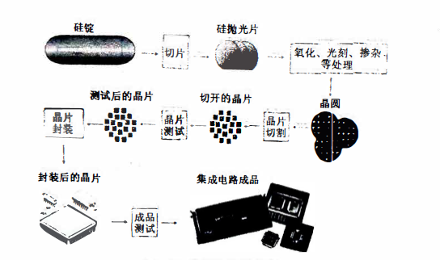
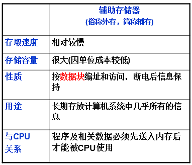

# 计算机基础

## 信息技术概述

### 信息与信息技术

#### *信息

客观世界三构素：信息、物质、能量

1.客观事物立场：事物运动的状态及状态变化的方式

2.认识主体立场：认识主体所感知或所表述的事物运动及其变化方式的形式、内容和效用

3.信息是人们认识世界和改造世界的一种基本资源

*4.信息是客观世界中各种事物**运动状态**和**变化内容的反应**，是认识主体对客观事物状态和变化的感知

*5.信息可以分为**数值型数据**和**非数值型数据**

*6.**数据**是信息的表现形式和载体

#### *信息处理过程（行为和活动）

- 收集
- 加工
- 存储
- 传递
- 施用

#### *信息技术IT

*用来**扩展**人的信息器官功能、**协助**人们进行信息处理的一类技术

*1.扩展人类感觉器官功能的**感测（获取）技术与识别技术**

*2.扩展神经系统功能的**通信技术**

*3.扩展大脑功能的**计算（处理）与存储技术**

*4.扩展效应器官手，脚等功能的**控制与显示技术**

#### *现代电子信息技术

*1.特点：以**数字技术（计算机）**为基础、**软件与通信技术**为核心、采用**电子技术**进行信息的收集、传递、加工、存储、显示与控制

2.设计领域：通信、广播、计算机、微电子、遥感遥测、自动控制、机器人等

3.核心技术：微电子技术、通信技术、计算机技术

**软件技术是信息技术的核心**


## 数字技术基础

### 比特与字节

#### 比特（b）

数字技术的处理对象是 “比特”，其英文为"bit", 中文译为 “二进制数字” 或 “二进位”。 比特只有两种状态（取值）：它或者是数字0, 或者是数字1。
比特是计算机和其他所有数字设备处理、存储和传输信息的最小单位，一般用小写字母"b" 表示。


#### 字节（B）

1000 0000 = 8b = 1B

另一种稍大些的数字信息的计量单位是“字节"(byte), 它用大写字母"B"表示， 每个字
节包含8个比特。
**字节是计算机处理、存储和传输信息的基本单位。**


### 定点数

**约定计算机中小数点的位置**

例：

约定小数点在末两个数字前

222222.22

333331121.44

约定小数点在所有数字后（及表示整数）

22222.

3333333.


### 进制运算

D ---十进制
H ---十六进制
B ---二进制
O或者Q ---八进制

十进制对应的二进制数

| 十进制 | 二进制 |
| ---- | ---- |
| 1| 1  |
| 2| 10  |
| 4| 100  |
| 8| 1000  |
| 16| 10000  |
| 32| 100000  |
| 64| 1000000  |
| 128| 10000000  |
| 256| 100000000  |
| 512| 1000000000  |


#### 二进制乘法


```
3*512+7*64＋4*8＋5，转换为2进制
首先，将其转换为2进制
11*1000000000+111*1000000+100*1000+101
二进制的乘法：
例如：
11*101
       11
  x  101
---------
      101
+  101
---------  
    1111
同理得出
110 0000 0000+1 1100 0000+10 0000+101+111 1110 0101

```


#### 二进制除法


#### 十进制整数转二进制

```
十进制：254

254/2=127余0
127/2=63余1
63/2=31余1
31/2=15余1
15/2=7余1
7/2=3余1
3/2=1余1
1/2=0余1

二进制:1111 1110
```


#### 十进制小数转二进制

```
十进制：0.625
0.625*2=1.25				取出整数部分1
0.25*2=0.5					  取出整数部分0
0.5*2=1							取出整数部分1

二进制：0.101
———————————————————
十进制：0.7

0.7*2=1.4                     取出整数部分1
0.4*2=0.8                     取出整数部分0
0.8*2=1.6					  取出整数部分1
0.6*2=1.2  					  取出整数部分1
0.2*2=0.4 		          	 取出整数部分0
0.4*2=0.8				      取出整数部分0
0.8*2=1.6					 取出整数部分1
.........
二进制:0.1011001.....
```


#### 二进制转八进制

二进制：1001110011

首先先三位为一组，不满三位头部填0

**0**10 011 100 110

2     3     4      6

八进制：2346


#### 二进制转十六进制

二进制：111110101101

首先先四位为一组，不满四位头部填0

1111 1010 1101<br/>
15     10	 13

16进制从10开始对应字母

| 十进制 | 十六进制 |
| ------ | -------- |
| 10     | A        |
| 11     | B        |
| 12     | C        |
| 13     | D        |
| 14     | E        |
| 15     | F        |

因此

15-F<br/>
10-A<br/>
13-D<br/>
十六进制：FAD


#### 二进制逻辑运算

##### 与运算^（逻辑加）

全0为0

​    0 1 1 0<br/>
^ 1 1 1  1<br/>
\-\-\-\-\-\-\-\-\-\-\--<br/>
​    0 1 1 0<br/>


##### 或运算V（逻辑乘）

全1为1

​    0 1 1 0<br/>
V 0 1 1  1<br/>
\-\-\-\-\-\-\-\-\-\-\--<br/>
​    0 1 1 1<br/>


##### 取反运算-

-01011=10100


##### 异或

相同为0

不同为1


##### 与或

相同为1

不同为0


### 原码、反码与补码

#### 原码

**原码就是符号位加上真值的绝对值，**即用第一位表示符号，其余位表示值。比如：如果是8位二进制：

[+1]原= 0000 0001

[-1]原= 1000 0001

第一位是符号位，因为第一位是符号位，所以8位二进制数的取值范围就是：（即第一位不表示值，只表示正负。）

[1111 1111 , 0111 1111]

即

[-127 , 127]

**原码是人脑最容易理解和计算的表示方式。**


#### 反码

反码的表示方法是：

正数的反码是其本身；

负数的反码是在其原码的基础上，符号位不变，其余各个位取反。

[+1] = [0000 0001]原= [0000 0001]反

[-1] = [1000 0001]原= [1111 1110]反

可见如果一个反码表示的是负数，人脑**无法直观的看出来**它的数值。通常要将其转换成原码再计算。


#### 补码

补码的表示方法是：

正数的补码就是其本身；

负数的补码是在其原码的基础上，符号位不变，其余各位取反，最后+1。(也即在反码的基础上+1)

[+1] = [0000 0001]原= [0000 0001]反= [0000 0001]补

[-1] = [1000 0001]原= [1111 1110]反= [1111 1111]补


#### 浮点字符的规范化表示

规范化表示二进制数

-11.001

公式：**N=SX2<sup>p</sup>**

**S**表示**尾数**

**P**表示**阶码**

-0.11001X2<sup>2</sup>

| 阶码符号 | 阶码 | 尾数符号 | 尾数位 |
| -------- | ---- | -------- | ------ |
| 0        | 10   | 1        | 11001  |

注意：尾数的小数开头必为1

例如

二进制数：0.0000001101

的尾数为**0.1101**X2<sup>-6</sup>

因此阶码越大，可表示的数越大

尾数越大，被表示的数精度越高


### ASCII 码

| 常用字符 | ASCII码 |
| -------- | ------- |
| 空格     | 32      |
| 0        | 48      |
| A        | 65      |
| a        | 97      |

要点：

大写A的ASCII码小于小写a，它们相差不是26而是32


1110 0001
奇校验规定：正确的代码一个字节中1的个数必须是奇数，若非奇数，则在最高位b7添1；

0110 0001

偶校验规定：正确的代码一个字节中1的个数必须是偶数，若非偶数，则在最高位b7添1。

8位中最高为就用来做数据校验，其余7位用于数据表示

ASCII码字符集有128个字符，其中96个是可见字符，32个可控制字符


## 微电子技术

微电子技术以**集成电路技术**为核心，**集成电路芯片**是信息产业的基础


### 集成电路

定义：以**半导体单晶片**作为材料，采用平面工艺加工，将大量晶体管、电阻等元器件及互连线构成的电子线路集成在基片上，构成一个微型化的电路或系统。

特点：**体积小，重量轻，可靠性高，功耗小。**

现代电路集成电路使用的半导体材料：硅、砷化镓。

工艺技术名称：硅平面工艺。

技术指标：线宽（主流技术线宽为45纳米或65纳米）

集成电路的工作速度主要取决于**组成逻辑门电路的晶体管尺寸**，晶体管尺寸越**小**，其极限工作频率就越**高**，门电路的开关速度就越**快**。


#### 集成电路的制作过程




### 集成电路分类

按所包含的电子原件数目分：

1. 中小规模集成电路的集成对象：**简单的门电路或单极放大器**；
2. 大规模集成对象：**功能部件、子系统**；

PC机所使用的微处理器、芯片组、图形加速芯片都是**超大规模**（VLSI）

按功能分：**数字集成电路、模拟集成电路、数/模混合集成电路。**

按用途分：**通用集成电路、专用集成电路**


### 摩尔定律

单块集成电路的集成度平均每**18~24**个月翻一番


### IC卡/集成电路卡

#### 按功能和用途分

**存储卡**（包括带加密逻辑的存储器卡）

**CPU卡**（如手机ISM卡）


#### 按使用方法分

**接触式**（通过金属触点传输数据）

**非接触式卡**（卡中无电池：利用电磁感应无线传输数据）

我国的第二代身份证、多数公交IC卡位**非接触式IC卡**


### RFID

RFID的中文名称是“电子标签“，它的原理与非接触式 IC卡相似，标签中包括耦合元件（线圈）及芯片， 它附着在物体表面用以标识目标对象， 每个RFID标签具有唯一的电子编码，使用阅读器可以读取（有时还可写入）标签中信息。


## 计算机的组成与分类

### 计算机的发展、组成与分类

- 计算机的发展 

  - 第一代：电子管

    - 典型代表：1946年美国宾州大学研制成功第1台数字电子计算机-ENIAC★

  - 第二代：晶体管
  - 第三代：中小规模集成电路
  - 第四代：大规模超大规模集成电路

- 特点

  - 速度快、通用性强；
    具有多种多样的信息处理能力；
    存储容量大、存取速度高；
    具有互联互通互操作的特性；
    体积小、功耗低、携带方便；

- 计算机系统的组成

  - 硬件系统★

    - CPU

      - 微处理器vs中央处理器：                                  
        CPU是微处理器中最重要的一种，计算机中的微处理器除了CPU，还有GPU、DSP等

       

      - 中央处理器CPU的概念：                                      

        特指承担系统软件和应用软件运行任务的处理器

    - 内存

      

    - 外存

      

    - 输入设备

    - 输出设备

    - （总线）

      - 定义

        - 用于连接CPU、内存、外存和各种I/O设备并在它们之间传输信息的一组共享/公用的传输线及其控制电路。

      - 分类

        - 按连接的设备分类

          - CPU总线/前端总线：CPU+内存
          - I/O总线：内存+I/O设备

        - 按传输的信号分类

          - 数据总线

            - 其位数决定了“字长”

          - 地址总线

            - 其位数决定寻址空间/容量

          - 控制总线

        - 按数据传输方式分类

          - 串行总线
          - 并行总线

  - 软件系统

    - 系统软件

      - 操作系统、数据库管理系统、程序语言处理系统等

    - 应用软件

      - QQ、Word、画图软件、娱乐软件等

- 分类

  - 巨型计算机/超级计算机

    - “采用大规模并行处理”——并行：多个CPU
    - 代表“天河一号/二号”，“神威太湖之光”
    - 应用领域：军事、科研、天气预报、石油勘测等

  - 大型计算机

    - 通常用于大型企业级服务器

  - 小型计算机/服务器

    - 中小型企业服务器或部门级服务器

  - 个人计算机/PC/微机

    - 衍生——工作站，显卡牛逼

  - 嵌入式计算机/单片机

    - 内嵌于其他数字设备中，执行特定的任务

## CPU的逻辑结构与原理

### CPU的逻辑结构（原理）

- 计算机之父——“冯·诺依曼”，匈牙利数学家，提出了存储程序控制原理。

- 传统的冯·诺依曼计算机结构与原理

  

- ★存储程序控制原理【仓库+中转站+加工厂】

  

- CPU的任务——执行指令，它按指令的规定对数据进行操作

- CPU的组成

  - 运算器
  - 控制器

    - 指令计数器

      - 用来存放CPU待执行的指令的地址，CPU按照地址从内存中读取所需要执行的指令。

    - 指令寄存器

      - 用来保存当前正在执行的指令，通过译码器解释该指令的含义，控制运算器的操作，记录CPU的内部状态

  - 寄存器组

    - 用来临时存放参加运算的数据和运算得到的中间
      或最后结果。

- CPU与内存之间的数据交换关系

  

### 指令与指令系统

- 指令的定义

  - 指令就是命令，它用来规定CPU执行什么操作。

- 指令的构成

  - 操作码
  - 操作数地址

- CPU执行指令的过程

  

  - 取指令
  - 指令译码
  - 执行指令
  - 修改指令计数器

- 指令系统的定义

  - CPU可执行的全部指令称为该CPU的指令系统

- Core处理器的七大指令系统

  - 数据传送类、算数运算类、逻辑运算类、              移位操作类、位操作类、控制转移类、输入输出类

- 其他★

  - 不同厂商生产的CPU的指令系统通常/一般不兼容；

    - 【特例】Intel和AMD兼容

  - 同一厂商生产的CPU的指令系统保持向下兼容。

### CPU的性能指标

- 衡量性能的方法

  - 参数角度：每秒钟可执行多少指令

    - MIPS【每秒钟执行多少条定点指令】
    - MFLOPS【每秒钟执行多少条浮点指令】

  - 运行角度：运行各种测评软件

- 影响CPU性能的主要因素/参数

  - 字长（位数）

    - 指通用寄存器和定点运算器的宽度（即二进制整数运算的位数）一次能计算多少位的数据32/64

  - 主频（CPU内部时钟频率）★

    - CPU的主频速度提高 1 倍，PC 机的处理速度也相应提高 1 倍 （X）
    - 在其它配置相同时，使用主频为 3GHz 的 Core i5 作为 CPU 的 PC 机，比使用主频为 2.5GHz 的Core i5作为 CPU的 PC 机速度快。（√）

  - 高速缓存的容量与结构   
  - 逻辑结构（微架构）
  - 内核数目
  - 指令系统

    - 简单+强大！短小精悍！

- 如何提高CPU的性能

  - 扩展CPU的字长
  - 扩充CPU的指令系统
  - 提高主频
  - 加快CPU前端总线的数据传输速率【前端总线连接CPU和内存】
  - 增大cache存储器容量、增加cache的级数
  - 改进CPU内部的逻辑结构
  - 采用多个CPU核 

## 主板、内存与IO

### 主板、芯片组与BIOS

- 主板

  - 规格、尺寸已标准化【19金科考点】
  - 决定了计算机的稳定性

- 芯片组

  - 概念

    - PC机各组成部分相互连接和通信的枢纽

  - 组成

    - 北桥

      - 存储控制中心，用于连接CPU、内存、显卡等高速设备，并与南桥芯片互联。    

    - 南桥

      - I/O控制中心，用于连接各种输入输出设备，各个扩展槽、I/O总线、以及各种输入输出接口等等。

  - 其他

    - 北桥中的大部分功能集成到了CPU中，剩余功能集成到了南桥芯片中。=》单芯片组
    - 芯片组决定了所使用的CPU的类型和参数
    - 芯片组提供了CPU的时钟频率
    - 芯片组决定了主板上所能安装的内存的最大容量和类型

- BIOS

  - 定义：“基本输入/输出系统”，存放在主板上只读存储器（ROM）芯片中的一组机器语言程序
  - BIOS程序存放在BIOS-ROM芯片中；
  - BIOS中四大构成

    - 加电自检程序POST
    - 系统自举程序BOOT
    - CMOS设置程序
    - 基本外围设备驱动程序

      - ★注意“基本”，打印机扫描仪都不算！

  - 什么时候需要配置BIOS▲

    -  PC 机组装好之后第一次加电 
    -  系统增加、减少或更换基本硬件或基本 I／O 设备 
    -  CMOS 芯片因更换电池、病毒侵害、放电等原因造成其内容丢失或被错误修改 
    -  用户希望更改或设置开机密码 
    -  系统因某种需要而调整某些参数

  - CMOS：RAM！断电数据丢失！配备单独纽扣电池
  - BIOS与CMOS的关系【工作台+仓库】

    - 通过 BIOS 程序对 CMOS 参数进行设置 
    - BIOS 中存放的是系统设置程序，CMOS 中存放的是这个程序所设置的数据； 

### 内存

- 内存与外存的对比

  

- 分类

  

- 内存的原理

  - 以字节为单位进行连续编址
  - 宾馆的例子
  - 掌握首地址、末地址、寻址空间的计算

- 缓存

  - 采用SRAM，速度比内存快；弥补 CPU与内存的速度差异，相当于主存的延伸。
  - 程序访问局部性原理，不与内存统一编址★常见判断，基于调度算法（常用/下一步最可能要用的）
  - 命中率问题
  - 如何提高命中率

    - 增大缓存容量
    - 采用多级缓存
    - 不能命中时，采用有效算法进行替换

- 内存条的物理结构

  

  - 接口形式：单列直插式SIMM、双列直插式DIMM
  - 双通道技术DDR：能够使两条同等规格内存所提供的带宽增长一倍。什么是带宽，就是所能达到的最大数据传输率。Double Data Rate双倍速率，做题碰见DDR，结果要x2；

### I/O总线与I/O接口

- I/O操作的特点

  - I/O操作与CPU的运算可同时进行
  - 多个I/O设备的操作也可同时进行工作
  - 每类I/O设备都有各自的控制器，它们按照CPU的I/O操作命令，独立地控制I/O操作的全过程！★

- 总线的定义

  - 用于在CPU、内存、外存和各种输入输出设备之间传输信息的一个共享的信息传输通路及其控制部件。

- 总线的分类

  - 按传输的信号分

    - 数据总线
    - 地址总线
    - 控制总线

  - 按连接的部件分

    - CPU总线/前端总线（CPU——内存）
    - I/O总线（CPU——输入输出设备）

  - 按传输的方式分

    - 并行传输
    - 串行传输

- I/O接口

  - 作用：I/O设备通过 I/O 接口与各自的控制器连接起来。
  - I/O接口分类

    - 数据传输方式

      - 串行接口
      - 并行接口

    - 是否能连接多种设备

      - 总线式[能连接多种设备USB]
      - 独占式[PS/2]

  - 频考USB

    - 通用串行总线接口
    - 各版本速率

      - 2.0=60MB/s=480Mbps
      - 3.0=400MB/s=3.2Gbps
      - 3.1=1.25GB/s=10Gbps

    - 支持即插即用
    - 使用USB集线器，扩展链接127个USB设备
    - 可向外提供+5V的电源

## 输入设备

### 键盘

- 机械键盘
- 电容键盘

### 鼠标

- 原理：（不重要）
- 分类

  - 机电式
  - 光电式

### 触摸屏

- 关键词“公共场合”

### 扫描仪

- 分类

  - 手持式扫描仪
  - 平板式扫描仪
  - 滚筒/胶片式扫描仪

- 原理

  - 光电转换【核心CCD电荷耦合器】★

- 性能指标

  - 分辨率——决定清晰度
  - 色彩位数——决定色彩丰富程度
  - 扫描幅面
  - 接口

### 数码相机

- 光电转换——CCD/CMOS

### 传感器

## 输出设备

### 显示器

- 显示器/监视器

  - LCD液晶显示器

    - 轻薄、电压低、辐射小、环保......

  - CRT阴极射线管显示器

    - 笨重、耗电、有辐射、色彩效果好......

- 显示控制器/显卡

  - 集成显卡
  - 独立显卡

### 显示器的性能指标

- 屏幕尺寸

  - 比例
  - 对角线（寸）

- 分辨率
- 刷新速率——图像的稳定性
- 响应时间
- 其他：亮度对比度、背光源类型、环保辐射

### 显卡的结构


- 组成：显示控制器、图形处理器、显示存储器、    
      接口电路
- 

### 打印机

- 针式打印机

  - 钢针撞击色带
  - 衍生：热敏打印机

- 激光打印机

  - 激光技术与复印技术的结合产物
  - 原理：激光成像+静电吸附碳粉

- 喷墨打印机

  - 墨盒+喷头，彩色图像打印效果较好

- 综合对比

  

## 辅助存储器

### 硬盘

- 五大组成部件

  - 磁盘盘片
  - 主轴与主轴电机
  - 移动臂
  - 磁头
  - 控制电路

- 数据定位三要素

  

  - 柱面号：哪片？
  - 磁头号：哪面？
  - 扇区号：哪个扇区？

- 平均存取时间

  

  - 平均寻道时间【磁头——>磁道】
  - 平均等待/旋转时间【扇区——>磁头下】

    - 转速rpm-》4200/5400/7200/10000

  - 数据传输时间：磁头往扇区读写数据的时间

- 性能指标

  - 容量
  - 平均存取时间
  - 缓存容量-》DRAM
  - 数据传输速率

    - 外部（快）
    - 内部（慢）：是提高硬盘性能的决定性因素★

  - 接口

    - SATA
    - PATA/IDE（大布条/淘汰）

### U盘、存储卡、固态硬盘

- 都使用闪存芯片的NAND分支；有寿命。
- SSD的工作机理——“隧道效应”

### 光盘

- 光驱
- 光盘盘片

  - CD★

    - 只读盘片（CD-ROM）
    - 一次性可写盘片（CD-R）
    - 可擦写盘片（CD-RW）

  - DVD

    - 单面单层4.7GB

  - BD

